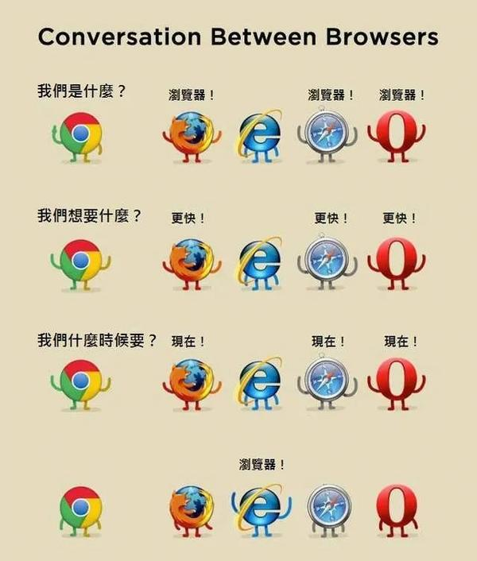
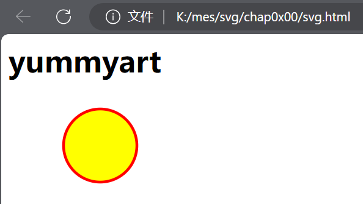
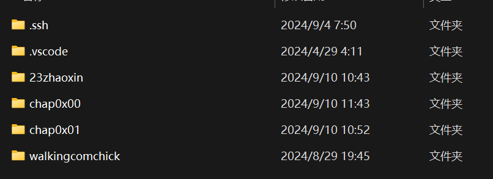
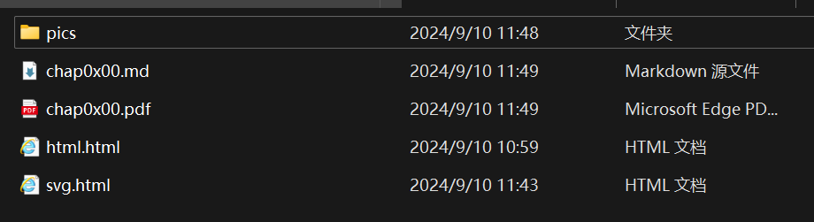

# 准备

## 环境和工具

标记语言不需要编译等过程，他只需要通过浏览器进行渲染，我们挑选一款浏览器装在机器上即可(我直接使用了Windows自带的edge，我感觉用火狐的好像挺多)



除此之外我们要挑选一个适合编写html文件的环境，我使用了上本科以来一直使用的**VScode**
下载**svg拓展**帮助我们高亮显示标签和层次结构以及预览界面
下载**markdown文件拓展**(未来众多专业课程都可能用到markdown来写和阅读实验报告或教学文档所以快下吧)

因为不用编译，其实也没啥环境配置可言，即插即用非常低龄

## SVG

### 定义

SVG 意为**可缩放矢量图形**（Scalable Vector Graphics）
SVG 是一种用于描述二维图形的 XML 标记语言，与位图图像不同，SVG图像以**文本形式存储**，并且可以缩放到任意大小而不会失真，因为它们基于数学描述而不是像素

SVG 广泛应用于网页设计、图标制作、数据可视化和其他图形相关的领域

### 特性

**矢量图形**：SVG 使用基于路径的矢量图形，这意味着图形可以无限放大而不失真
**可伸缩性**：SVG 文件可以在不同的分辨率下保持清晰，适合用于响应式设计
**互动性**：SVG 可以与 JavaScript 结合，实现动画和交互效果
**集成性**：SVG 可以直接嵌入 HTML5 中，无需使用外部文件
**兼容性**：大多数现代浏览器都支持 SVG

```html

<html>
<body>
 
<h1>yummyart</h1>
 
<svg xmlns="http://www.w3.org/2000/svg" version="1.0">
  <circle cx="100" cy="50" r="40" stroke="red"
  stroke-width="3" fill="yellow" />
</svg>
 
</body>
</html>
```



### 与培训的联系

本培训主要是针对于公众号推文的制作
SVG可以应用到推文中
实现用户交互和多样化的展示
我们通过展示和解读某些推文实例，思考并设计SVG组件，拓宽我们作为自媒体的输出口径

## 联想

### HTML

超文本标记语言（英语：HyperText Markup Language，简称：HTML）是一种用于创建网页的标准标记语言

```html

<!DOCTYPE html>
<html>
<head>
<meta charset="utf-8">
<title>文艺部真好吃(yummyart)</title>
</head>
<body>
    <h1>我的第一个标题</h1>
    <p>我的第一个段落</p>
</body>
</html>
```

### XML

XML 指可扩展标记语言（eXtensible Markup Language）
XML 被设计用来传输和存储数据，不用于表现和展示数据，HTML 则用来表现数据

### 标签

```html

<body>
  <svg>

  </svg>
</body>
```

等等成对存在互相嵌套，标记内容功能和信息的字段

## 开发准备

在你的工作文件夹整理好每次工作需要的子工作文件夹
所有的图片再单独保存到一个pic文件夹
注意url编写的规范




