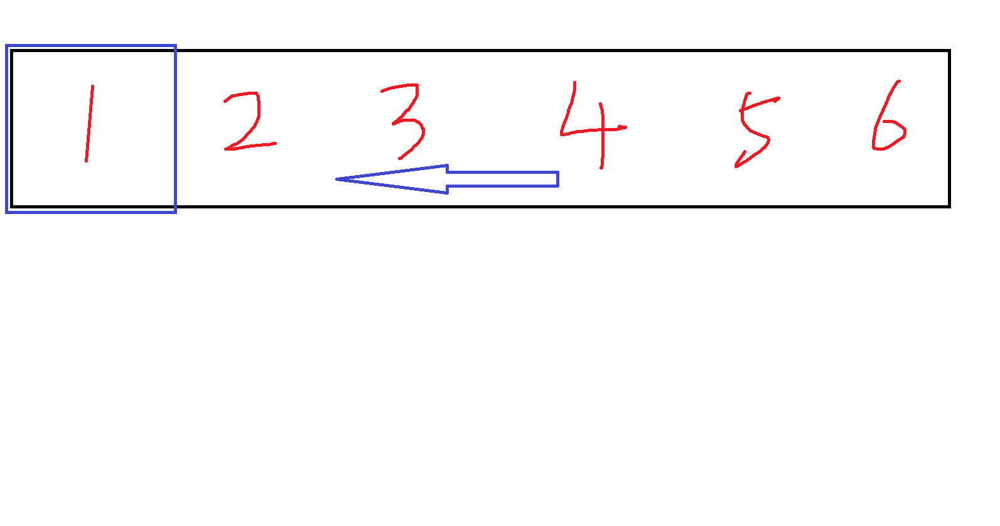

# 点击展开示例

## 核心代码

核心代码和预览文件请参考资料包中的其他文件
其中后缀为svg的文件是我用于在本地编辑代码的文件
后缀为html的两个文件是用于在浏览器中预览的文件
以及准备培训内容时使用的备份文件

## 设计逻辑

用户进入推文页面后3s自动播放一个**六个序列帧**的**路径动画**

## 分段说明

### 序列动画

```html
<foreignObject x="0" y="0" width="300" height="300">
    <svg viewbox="0 0 300 300">
        <g>
            <foreignObject x="0" y="0" width="300" height="300">
                <svg viewbox="0 0 300 300" style="background-image:url(pics/sample1.jpg);background-repeat:no-repeat;background-size:100%;">
                </svg>
            </foreignObject>
            <g>
                <foreignObject x="300" y="0" width="300" height="300">
                    <svg viewbox="0 0 300 300" style="background-image:url(pics/sample2.jpg);background-repeat:no-repeat;background-size:100%;">
                    </svg>
                </foreignObject>
                <g>
                    <foreignObject x="600" y="0" width="300" height="300">
                        <svg viewbox="0 0 300 300" style="background-image:url(pics/sample3.jpg);background-repeat:no-repeat;background-size:100%;">
                        </svg>
                    </foreignObject>
                    <g>
                        <foreignObject x="900" y="0" width="300" height="300">
                            <svg viewbox="0 0 300 300" style="background-image:url(pics/sample4.jpg);background-repeat:no-repeat;background-size:100%;">
                            </svg>
                        </foreignObject>
                        <g>
                            <foreignObject x="1200" y="0" width="300" height="300">
                                <svg viewbox="0 0 300 300" style="background-image:url(pics/sample5.jpg);background-repeat:no-repeat;background-size:100%;">
                                </svg>
                            </foreignObject>
                            <g>
                                <foreignObject x="1500" y="0" width="300" height="300">
                                    <svg viewbox="0 0 300 300" style="background-image:url(pics/sample6.jpg);background-repeat:no-repeat;background-size:100%;">
                                    </svg>
                                </foreignObject>
                            </g>
                        </g>
                    </g>
                </g>
            </g>
            <animateTransform attributeName="transform" type="translate" values="0 0;-300 0;-600 0;-900 0;-1200 0;-1500 0" dur="1s" repeatCount="indefinite" calcMode="discrete"></animateTransform>
        </g>
    </svg>
</foreignObject>
```

逻辑上嵌套的六个序列帧
然后使用animateTransform标签标识图片转换动画

### 路径动画

```html
<animateMotion path="M165.059 0.418915C277.859 73.9189 541.059 245.419 541.059 506.919C541.059 768.419 358.009 925.931 279.559 965.419C162.709 1052.57 -109.941 1255.92 279.559 1389.42C669.059 1522.92 692.672 1923.18 661.059 2080.42C651.309 2126.02 628.559 2232.42 359.559 2570.92C90.5593 2909.42 23.4843 2981.71 23.5593 2976.42C2.85933 3010.77 -45.4407 3090.92 117.059 3226.92"
value="0;0.0001;1" dur="10000000s" fill="freeze" restart="never" rotation="auto"></animateMotion>
<animateMotion path="M165.059 0.418915C277.859 73.9189 541.059 245.419 541.059 506.919C541.059 768.419 358.009 925.931 279.559 965.419C162.709 1052.57 -109.941 1255.92 279.559 1389.42C669.059 1522.92 692.672 1923.18 661.059 2080.42C651.309 2126.02 628.559 2232.42 359.559 2570.92C90.5593 2909.42 23.4843 2981.71 23.5593 2976.42C2.85933 3010.77 -45.4407 3090.92 117.059 3226.92"
dur="8s" fill="freeze" restart="never" rotation="auto" begin="3s"></animateMotion>
```

使用animateMotion标签标识路径动画

## 要点说明

### 序列动画的逻辑

**animateTransform标签定义变换动画**也即控制其父级元素某个属性(如高度宽度)的变化

每一个

```html
<foreignObject>
```

标签都承载了一张序列帧，一共六个，每个该标签标识的横坐标都相差300

使得我们的六张序列帧是以横向并排的方式渲染在一个300*300的视窗内(也就是同时最多可以显示一张完整的序列帧)



在播放的时候，六张连在一起的图片向左移动，使得靠右的图片逐个显示
这个移动每一步都为-300(向左为负)px
一共移动-1500，一共用时1s，循环播放

### 路径动画的逻辑

**animateMotion标签定义路径动画**也即整个其父级元素在空间中的坐标和旋转程度的变化

可以看到有两个极为相似的动画标签

第一个标签是为了保证动画对象在第3s时的**路径动画开始之前保留在原始的位置上**
第二个标签是有正式功能的动画标签

路径动画新颖之处即是**path属性**
他的模式由其中的字母标识：M（移动到）、L（直线到）、H（水平线到）、V（垂直线到）、C（三次贝塞尔曲线）、S（光滑曲线）、Q（二次贝塞尔曲线）、T（光滑二次贝塞尔曲线）、A（圆弧）、Z（闭合路径）等
坐标数据就由字母标识后的浮点数标识

我们没有必要手敲路径信息，可以通过绘图软件绘制曲线后导出为svg文件，从这个svg文件中获取这个曲线本身的path，然后复制到我们的动画标签中即可

本动画中的原始path文件请参考**资料包中的其他文件**

## 联想

### 贝塞尔曲线

它通过控制曲线上的四个点（起始点、终止点以及两个相互分离的中间点）来创造、编辑图形。其中起重要作用的是位于曲线中央的控制线。这条线是虚拟的，中间与贝塞尔曲线交叉，两端是控制端点。移动两端的端点时贝塞尔曲线改变曲线的曲率（弯曲的程度）；移动中间点（也就是移动虚拟的控制线）时，贝塞尔曲线在起始点和终止点锁定的情况下做均匀移动

### 动画

#### 序列

一系列连续的静态图像帧，这些帧按照一定的时间顺序排列，当快速连续播放时，会呈现出动态画面的效果

#### 矢量

#### 3D

#### MG

#### 定格
